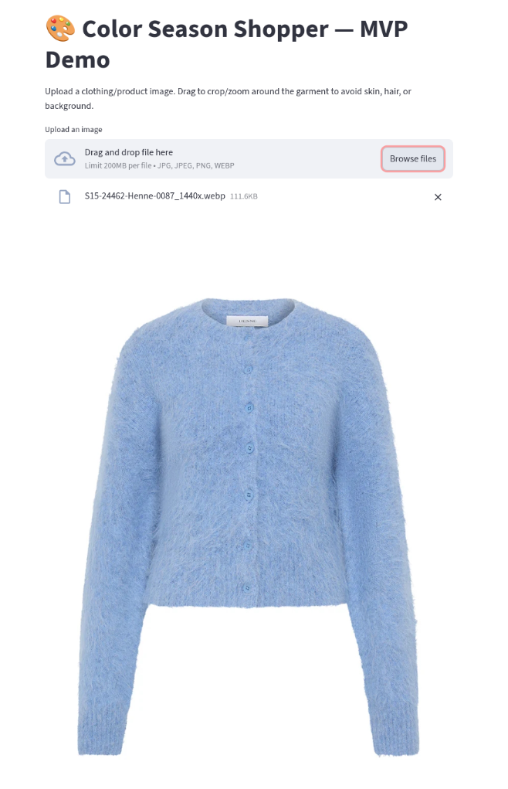
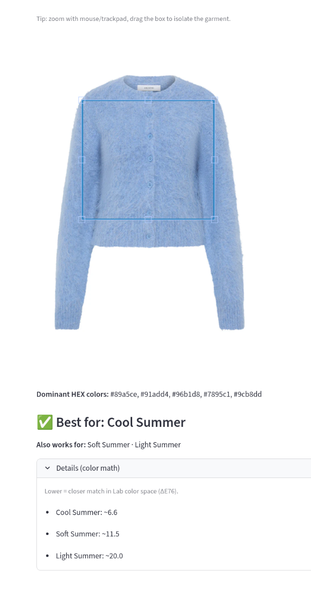

# 🎨 Color Season Shopper (MVP)

**Color Season Shopper** is a lightweight demo app that helps you see which seasonal color palette a clothing item fits best.  
Upload a product photo, crop to the garment, and the app will analyze the dominant colors and suggest the **best color season** (e.g., Soft Summer) and **other seasons it could work for**.

Built with **Python + Streamlit**, using color science in Lab space (ΔE76).

---

## ✨ Features
- Upload any product image (JPEG/PNG/WebP)
- Interactive crop/zoom so you can isolate the garment
- Extracts dominant colors automatically
- Ranks palettes across **9 classic color seasons**
- Clear decision language:
  - ✅ **Best for:** the closest season
  - ➕ **Also works for:** other likely matches
- Batch mode (process a CSV of product images)

---

## 🚀 Quickstart

### Clone & Install
```bash
git clone https://github.com/<your-username>/color-season-shopper.git
cd color-season-shopper
python -m venv .venv
source .venv/bin/activate   # or .venv\Scripts\activate on Windows
pip install -r requirements.txt
```

### Run the Streamlit Demo
```bash
streamlit run streamlit_app.py
```
Then open http://localhost:8501 in your browser.

<p align="center">  </p> <p align="center">  </p>

---

## 📊 How It Works (the math)

- Extract dominant colors → convert to CIE Lab color space.

- Compare garment colors against each palette using ΔE76 (Euclidean distance in Lab).

- Lower ΔE = closer visual match.

- Return the closest palette as “Best for” and the next two as “Also works for.”
---
## 🛣️ Roadmap

✅ MVP: color extraction + palette ranking

⏩ Chrome extension overlay

⏩ Smarter color difference (ΔE2000)

⏩ Automatic garment segmentation (replace manual crop)

## 📜 License

Copyright © 2025 Alina Ryan. All rights reserved.

This project is provided for demonstration and evaluation purposes only.  
No part of this repository, including code, documentation, or other content,  
may be copied, modified, distributed, or used for commercial purposes  
without prior written permission from the author.
